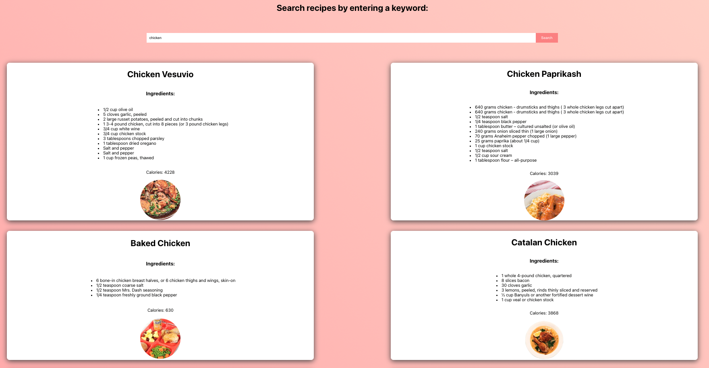

# SpotifyRecommendationAPP

A Webserver Application to generate personalized Spotify Song recommendations based on the user's top songs.


## Screenshots




## Getting Started


### Dependencies

* Dependencies are listed in the package.json file


### Installing


* If you wish to locally run the server, few modifications need to be made.
  1. Get your own free Edamam API credentials at https://developer.edamam.com/edamam-recipe-api
  2. In the App.js change
     ```sh
     const APP_ID = "<dummy_appID"
     const APP_KEY = "<dummy_appKey"
     ```
     to
       ```sh
       const APP_ID = "<insert_your_appID"
       const APP_KEY = "<insert_your_appKey"
     ```

### Executing program

* My website is running under the url: https://reciperecommendation-fd745.web.app

  
* Running the webserver on your own machine, after setting up as listed above, can be done as follows:
```
npm run
```

## Help

For any problems and issues. Feel free to open an issue or shoot me an email at williamyihaozhang@gmail.com

## Authors


William Zhang
[LinkedIn](https://www.linkedin.com/in/william-yihao-zhang-037b78238/)

## Acknowledgments

Inspiration, code snippets, etc.
* [Great Youtube Tutorial on using Edamam API by ](https://www.youtube.com/watch?v=xc4uOzlndAk&t=922s&ab_channel=developedbyed)
* [Edemam API Documentation](https://developer.edamam.com/edamam-docs-recipe-api)
*

##Contributing
Pull requests are welcome! For major refactors, please open an issue first to discuss what you would like to improve. Feel free to create a fork of this repository and use the code for any noncommercial purposes.
